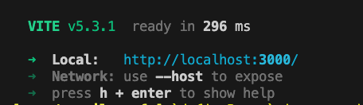
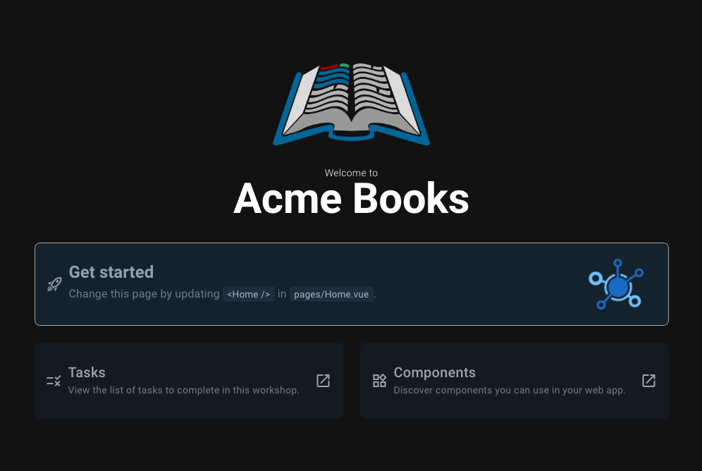

# Step 1: Clone and run the base app

## a) Download a copy of the base app
Open your terminal/command prompt.</br>
You can do this on a mac by pressing command+space at the same time. When the Spotlight opens, type "Terminal" and press enter.</br>
For a Windows machine, press Windows+R to open the "Run" box. Type "cmd" and then click OK to open a regular command prompt.

Type the following into your terminal/command prompt, note that text after a hash (#) is a helpful comment from us.

```bash
cd ~/Documents/
# this command will change the folder (cd means change directory) you are using to your documents so all your work will be saved there.

# now we need to clone the github repository so that you get the starter code on your machine in your documents folder.
git clone git@github.com:pendo-io/acme-books-workshop.git
```
Open your code editor and then click File > Open and choose the `ACME-BOOKS-WORKSHOP` folder in your documents folder.

Here is a rough file structure and explanation of some of the key folders and files.

```bash
├── data
    ├── books.get.json # the full list of books
├── docs
    └── ... # documentation including these instructions
├── src
    └── assets
        └── ... # static files, e.g. images
    └── components
        └── ... # reusable UI components (e.g. AppFooter.vue). We will be using these in our homepage.
    └── layouts
        ├── default.vue # default structure/template for pages
    └── pages
        ├── index.vue # main Vue component for the index route/page. This is our homepage where we will be doing most of the work.
        └── ... # other pages (http://127.0.0.1:3000/my-page => my-page.vue)
    └── services
        ├── api.service.js # function for fetching data
    └── stores
        ├── bookStore.js # Frontend Pinia store with state, getters, and actions to store and manipulate the books data after it has been loaded from file.
    ├── App.vue # root component, renders app structure.
    ├── main.js # entry point, initializes Vue app.
```
Don't worry if this doesn't make much sense right now, we'll explain what specific parts are as we go through this workshop.

## b) Install the node dependencies
Go back to your terminal/command prompt and type the following. This will install all dependencies needed for this project.

```bash
npm i
```

## c) Start the development server
To start the app run the following in your terminal/command prompt.

```bash
npm run dev
```

This will start a local development server on your laptop. You should see the following returned in your terminal/command prompt:



You can visit your app in your browser by clicking the link returned.

You should see the following webpage:



## d) Make your first change
Open `src/pages/index.vue` and update the page heading from `Welcome to ACME Books` to something of your choice.

You'll see the page heading between `<h1 />` tags. This is HTML and the h tags are used to define headers.</br>
You can read more about HTML heading tags on [w3schools](https://www.w3schools.com/tags/tag_hn.asp).

Save your changes and have a look at your webpage - it should have updated to show your new text. You may need to reload the page for the changes to take effect.

<hr style="margin-top: 32px">
<div style="display: flex; justify-content: space-between; margin-top: 16px; font-weight: bold; font-size: 16px">
  <span></span>
  <span><a href="README.md">🏠 Home</a></span>
  <span><a href="./step-2.md">Next Step →</a></span>
</div>
