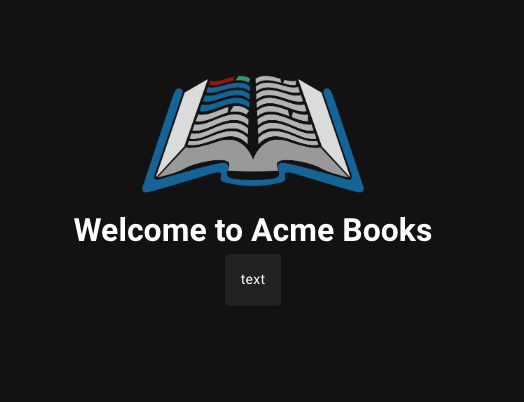
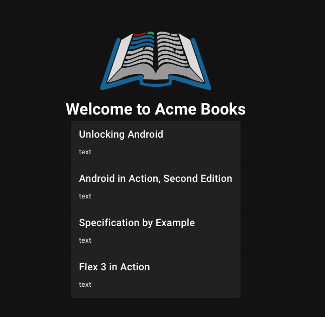

# Step 2: Add the favorite books component to the homepage
## What is a component?
Components are reusable blocks of code that contain a specific part of the user interface, e.g. a table, a navbar, a header or footer.
This lets us break down our web page into smaller pieces that are easier to work with. A web page often consists of many components, and components may also consist of other components.</br>
We can make components in Vue ourselves, or use built-in components from a library. 

## a) Take a look at the data file
Open up the `books.json` file. You'll find it in the `/data` folder.

Note: By default, VSCode opens files in preview mode. This is indicated by their name being italic in the menu bar at the top. You can double click on the file to fully open it. It was also remain open fully if you make any changes or double click its tab header in the menu bar at the top.

Each book stored in `/data/books.json` has a favorite field that, if true, marks that book as a favorite book. In this step you will display those favorite books on the homepage.

Note that most coding keywords are in American English, e.g. favorite, color, etc.

## b) take a look at the component file
Open `/src/components/BookCard.vue` and have a look at it. It has three main sections: template, script and style and is an example of a custom Vue component.

The template is where you structure your component using HTML. HTML is a markup language that is used to tell your browser what and how to display your elements. Some examples of elements are: headings, buttons, and paragraphs. You can learn more about HTML on [w3schools](https://www.w3schools.com/html/).

The script is where the logic goes using JavaScript. JavaScript is the most popular programming language in the world and allows you to create more complex web pages where the content updates dynamically. 

Finally there is a style section where you can define the styles for your component using CSS. For example background color, text color, object size, font etc.

All three technologies work together to create dynamic web pages and apps.


## c) Add the BookCard component to home page
The BookCard component is currently not being used by the homepage. Follow the steps below to add it:
1. Open `src/pages/index.vue` (the homepage component).
2. Find the `<div />` that has step 2 underneath it.
3. Add the component `<book-card />` underneath the 'Step 2 ...' line. Your code should look something like this:

```
<div class="cards-container">
  <!-- Step 2: Add the <book-card/> component here. -->
  <book-card />
</div>
```

In the `<script />` section we have pre-filled a few lines of code to help show this component on your screens. Save your changes and have a look at your webpage.

You should see the following:<br/>


## d) Adding properties to the component
In `index.vue` we already return a list of the `favoriteBooks` for the component to use in the template in this line:
``` javascript
const favoriteBooks = bookStore.getFavoriteBooks;
```
This line of code looks through all the books that are in the `data.json` file and returns the books that have been marked as a favorite.

We do this using the `v-for` loop (a built-in vue loop function) and to do this successfully, we need a unique identifier or key, e.g. the `isbn`. 

We also want to display the title of the book. 

We need to use the following pattern when adding any data to our component: `:prop-name="value"`.</br>
For example, we can pass the title to the component by doing `:title="book.title"`. We have to tell the component that the title comes from the books object.

Add the `v-for` line, and the `isbn` and `title` properties to your `<book-card />` component as follows:

```html
<book-card
  v-for="book in favoriteBooks"
  :key="book.isbn"
  :title="book.title"
/>
```
You should see the following webpage:<br/>


### i) v-for loop further information
Technical explanation: The `v-for` line uses the store getter `getFavoriteBooks`, which gets all of the books from `books.json` that have `favorite: true` set. We can use `v-for` to loop through each book in the favorite books list and create a book card component for each of the favorite books. The `v-for` requires a unique key for each component, in our case the isbn.

<hr style="margin-top: 32px">
<div style="display: flex; justify-content: space-around; margin-top: 16px; font-weight: bold; font-size: 16px">
  <span><a href="./step-1.md">← Previous Step</a></span>
  <span><a href="README.md">🏠 Home</a></span>
  <span><a href="./step-3.md">Next Step →</a></span>
</div>