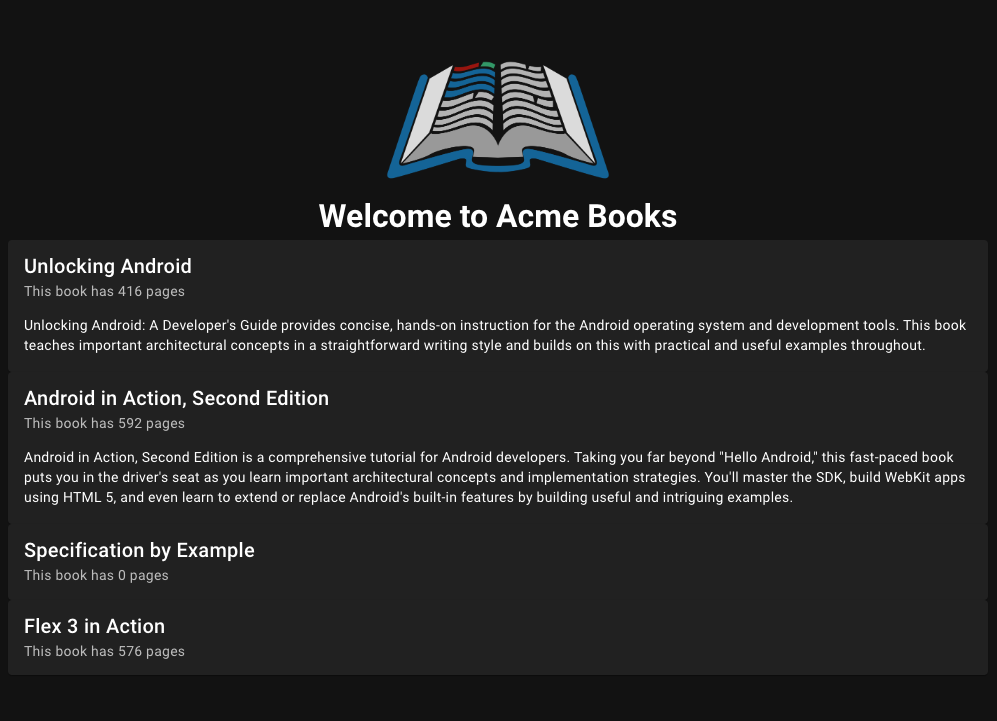

# Step 3.1 (optional): Update the card component to display a description
We're going to add a short description to the component now for a little bit more content.

If you'd like to try this on your own, please do. Otherwise you can follow the steps below.

## a) Add a description function
In `src/pages/index.vue`, create a new line under your `pageCount` function.

### i) Create a variable called shortDescription
Don't forget to use the `const` keyword and give it a name, in our case `shortDescription`. 
You can follow the `pageCount` pattern to help. Make the variable return the value of `books.shortDescription`. 

### ii) Update the props in the `<book-card />` component
Following the pattern of the `:pageCount` prop, add a prop for `:shortDescription` that equals your `shortDescription` function. 
Note: the webpage will not yet show your description property because we need to add it to the `BookCard.vue` file.

### iii) Update the `BookCard.vue` file
1. Open `src/components/BookCard.vue`.
2. Remove the forward slashes and space (`// `) from the line `// description: String,`.
3. Copy the line `:text="shortDescription"` from `<v-card-copy />`.
4. Paste it under the `:subtitle="pageCount"` line in `<v-card />`.

The webpage should now look like this:

  <a href="./step-3.md">← Previous Step</a>
  <a href="README.md">🏠 Home</a>
  <a href="./step-4.md">Next Step →</a>

