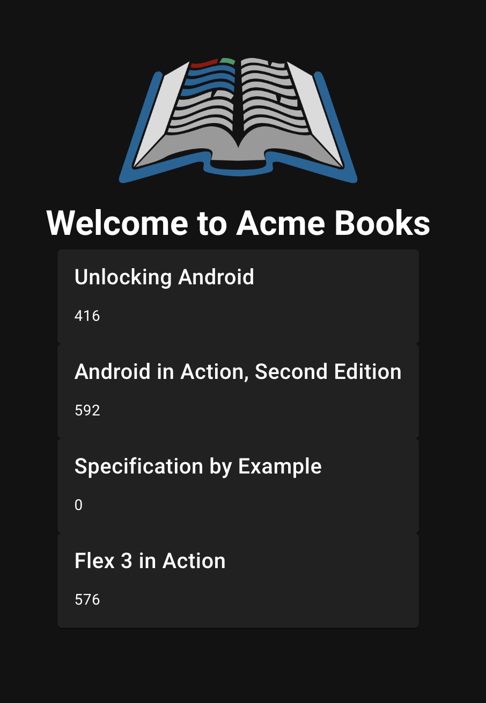
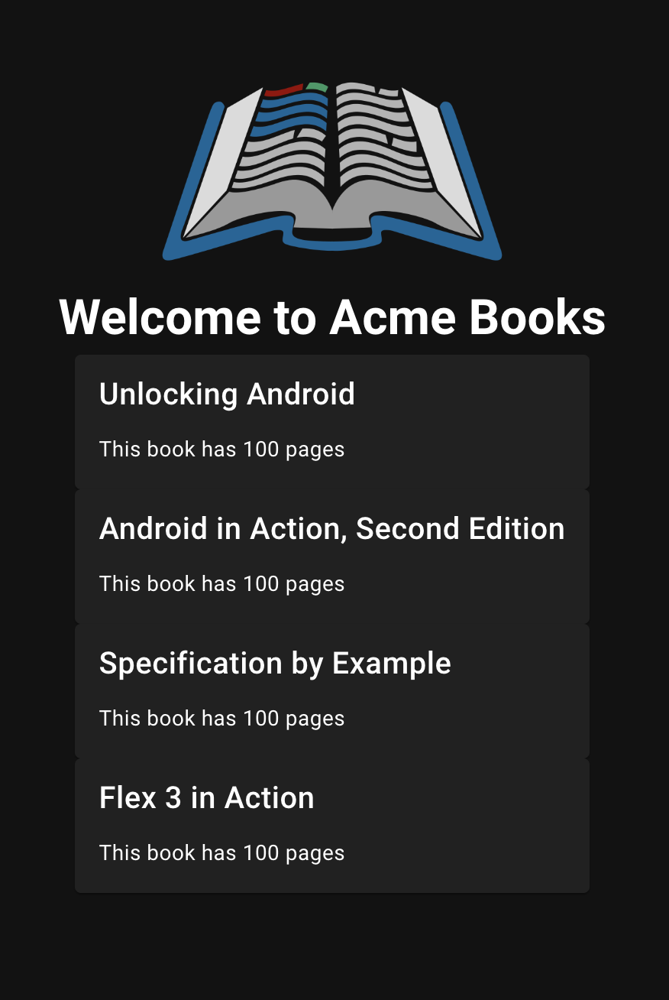
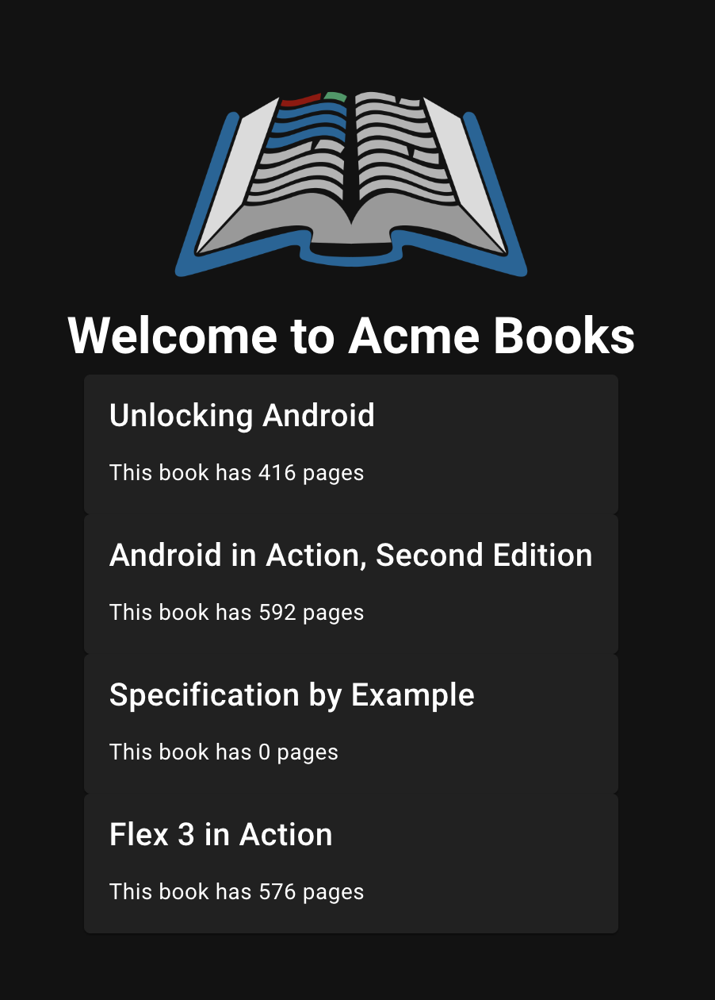

# Step 3: Update the card component to display more information
Open `src/components/BookCard.vue` and you will see that it uses a `<v-card />` component inside the `<template/>`.</br>
As you may recall from step 2, the template is where you structure your component.

The `<v-card />` component comes from the vuetify component library. This is a library full of many building blocks such as buttons, dialogues etc.</br>
To read more about `<v-card />`, you can look at the [vuetify card component](https://vuetifyjs.com/en/components/cards/) doc.

On your webpage, you'll currently see the cards contain the title of the book and then the word 'text' underneath. This is because we have provided the `text` property with a value of 'text'.</br>
We are going to change this so that the card component displays the page count of the book instead of 'text'.

We are storing all our book information in a [JSON data file](https://www.w3schools.com/js/js_json_intro.asp), `data/books.json`.</br>
Open the file and you'll see there's some information (data in name:value pairs) for each book (ojbect). Each object is wrapped in curly braces `{object}`.

For example:

``` json
      {
        "isbn": "1933988673",
        "title": "Unlocking Android",
        "pageCount": 416,
        "categories": [
          "Open Source",
          "Mobile"
        ],
        "favorite": true
      }
```

We're going to be adding `pageCount` into our component card.

## a) Look at the v-card anatomy
Have a look at the [anatomy of a v-card](https://vuetifyjs.com/en/components/cards/#anatomy). You'll see there are a few different parts that we can add to our card component. We'll pick `subtitle` for page count.

## b) Remove the line that shows 'text'
1. Open `src/components/BookCard.vue`
2. In the `<v-card />` component, remove the `text="text"` line and save your changes.
Your webpage should now only show the titles of the books.

## c) Add the pageCount to the component
1. Open `src/pages/index.vue`
2. In the `<book-card />` component, underneath the `:title` line, add the following:
```
:subtitle="book.pageCount"
```
Here, we are saying that we want to use the `subtitle` area to display the number of pages (`pageCount`) for each of the favorite books.</br>
Your page should look something like this:



This isn't super helpful to people reading this as they probably won't know what the number means.

## d) Update the property so that it returns some helpful text as well as the number of pages
We're going to start by defining a new variable that should return a string, for example 'This book has 100 pages'.</br>
A variable is something that stores information that could change. 

### i) Create a variable called pageCount
To create a new variable, you'll need to use the `const` keyword and then a variable name, in our case `pageCount`.

In `src/pages/index.vue`, find the line starting with `Step 3...` and create a new line under the comment.
Make the variable return a string ("text") that says `"This book has n pages"` where n = any number you choose. Your text will need to be wrapped in quote marks. For example:
```
const pageCount = "This book has 100 pages";
```

### ii) Update the :subtitle property in the `<book-card />` component to show the returned value
Still in `src/pages/index.vue`, update the `:subtitle` property in the `<book-card />` component from `book.pageCount` to our new variable `pageCount`. Your webpage should look something like this:



This now shows the same number of pages for each book, which isn't right. We're going to bring these two steps together so that we show the correct number of pages for each book.

### iii) Add the pageCount property to your variable and turn it into a function
A function is a self-contained module of code that performs a specific task.</br>
An argument is an [object](https://developer.mozilla.org/en-US/docs/Web/JavaScript/Reference/Global_Objects/Object) that is sent to the function when it is called. In our case, we are sending the book object to the function. We want it to return the pageCount property of the book.</br>
A [property](https://developer.mozilla.org/en-US/docs/Glossary/Property/JavaScript) is a part of an object that consists of: 
- A name (also called a key)
- A value

Your new function should use the book's pageCount property (the number of pages) within the string that you wrote in the previous step.</br>
Follow these steps to change our pageCount variable into a function. It should take `(book)` as an argument and return the `book.pageCount` property in the string.

1. Open the `src/pages/index.vue` file.
2. Find the variable `pageCount` that you created previously.
3. Update the line using this as a guide:
``` javascript
const pageCount = (argument) => `Some text ${property};`
```
4. Update 'some text' to be an indication of page number, for example `This book has ${property} pages`. Note, you will need to use backtick (``) characters here rather than quotes ("").

We put the property value inside curly braces `${property}` so that our variable (pageCount) can be used in the string (our "This book has n pages" text).

In the `<book-card />` component, the `:subtitle` property is already using `pageCount`, but we need to tell it to use the book argument for the function to work properly. We do this by adding `(book)` in parentheses after calling the `pageCount` function.

```javascript
  :subtitle="pageCount(book)"
```

Your `<book-card />` component should now look like this:

``` javascript
<book-card
  v-for="book in favoriteBooks"
  :key="book.isbn"
  :title="book.title"
  :subtitle="pageCount(book)"
/>
```
The webpage should now look like this:



### iv) Best practices
We follow sets of best practices so that our code is more readable and easier to maintain. Now we need to implement some best practices into our code.

1. Open `src/components/BookCard.vue`.
2. In the `<script/>` section, find the line `// pageCount: String,` and remove the forward slashes and space (`// `).
3. Between the `<template/>` and `<script/>` sections find the line `:subtitle="pageCount"` from `<v-card-copy />` and copy it.
4. In the `<template/>` section, in the `<v-card />` component, paste the line under the `:title="title"` line.
5. Open `src/pages/index.vue`.
6. In the `<book-card />` component, replace `:subtitle` with `:pageCount`

Thinking back to the [anatomy of the v-card component](https://vuetifyjs.com/en/components/cards/#anatomy), we're using the `subtitle` element for our pageCount function because we want the page count text to show in the subtitle space and theme. To make our code easier to read, we're using the variable `pageCount` as our `:subtitle` property.

Your `<v-card />` component in `src/components/BookCard.vue` should now look like this:

``` javascript
<v-card
  :title="title"
  :subtitle="pageCount""
/>
```

Your `<book-card />` component  in `src/pages/index.vue` should now look like this:

``` javascript
<book-card
  v-for="book in favoriteBooks"
  :key="book.isbn"
  :title="book.title"
  :pageCount="pageCount(book)"
/>
```

Your webpage should not have changed, and should still show the book title and page count. If you're confused or want to know more, ask us!

If you want to add more details to your component, try it out in <span><a href="./step-3-1.md">step 3.1</a></span>. If you want to start styling your page, click next step!


<hr style="margin-top: 32px">
<div style="display: flex; justify-content: space-around; margin-top: 16px; font-weight: bold; font-size: 16px">
  <span><a href="./step-2.md">← Previous Step</a></span>
  <span><a href="README.md">🏠 Home</a></span>
  <span><a href="./step-4.md">Next Step →</a></span>
</div>