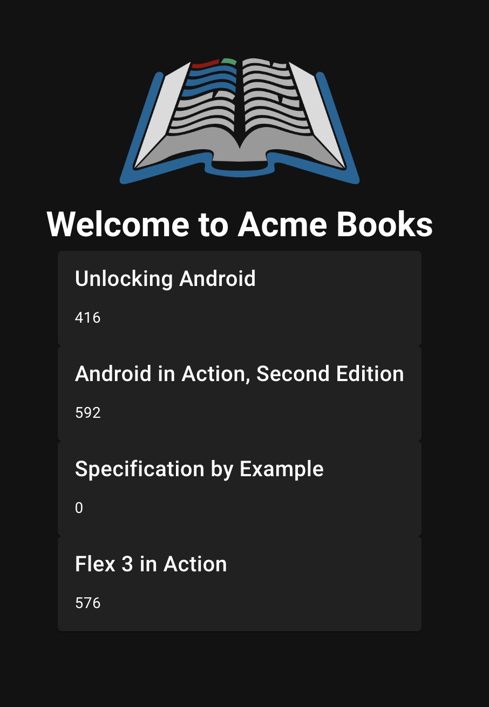
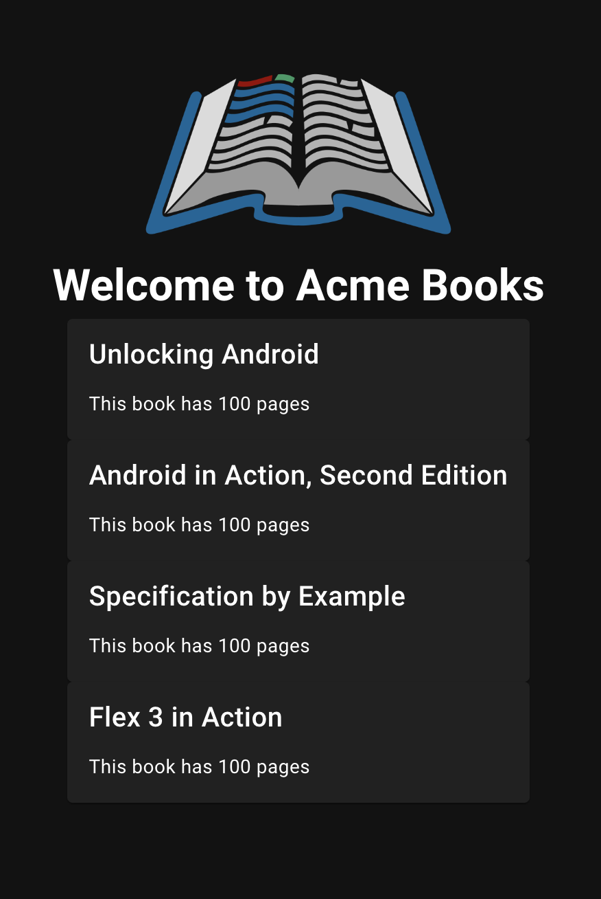

# Step 3: Update the card component to display more information
Open `src/components/BookCard.vue` and you will see that it uses a `<v-card />` component inside the `<template/>`.</br>
As you may recall from step 2, the template is where you structure your component.

The `<v-card />` component comes from the vuetify component library. This is a library full of many building blocks such as buttons, dialogues etc.</br>
To read more about `<v-card />`, you can look at the [vuetify card component](https://vuetifyjs.com/en/components/cards/) doc.

On your webpage, you'll currently see the cards contain the title of the book and then 'text' underneath.</br>
We are going to change this file so that the card component displays the page count of the book instead of 'text'.

Open the `data/books.json` file and you'll see there's some information for each book, for example:</br>
``` json
      {
        "isbn": "1933988673",
        "title": "Unlocking Android",
        "pageCount": 416,
        "categories": [
          "Open Source",
          "Mobile"
        ],
        "favorite": true
      }
```
We'll be focussing on the strings (isbn, title) and numbers (pageCount), but for a deeper understanding of what other types of data there are, see the [MDN web docs](https://developer.mozilla.org/en-US/docs/Web/JavaScript/Data_structures).

We're going to be adding `pageCount` into our component card.

## a) Look at the v-card anatomy
Have a look at the [anatomy of a v-card](https://vuetifyjs.com/en/components/cards/#anatomy). You'll see there are a few different parts that we can add to our card component. We'll pick `subtitle` for page count.

## b) Add the pageCount to the component
In `src/pages/index.vue`, in our `<book-card />` component, add the line
```
:subtitle="book.pageCount"
```
This will bring back the number of pages for each of the favorite books.</br>
Your page should look something like this:



This isn't super helpful to people reading this as they probably won't know what the number means.

## c) Add a function to return some helpful text with the number of pages
We're going to start by defining a new variable that should return a string, for example 'This book has 100 pages'.</br>
A variable is something that stores information that could change. 

In `src/pages/index.vue`, find the line with `Step 3...` and create a new line under the comment.

### i) Create a variable called pageCount
To create a new variable, you'll need to use the `const` keyword and then give it a name, in our case `pageCount`.
Make the variable return a string (text) that says `"This book has n pages"` where n = any number you choose. For example:
```
const pageCount = "This book has 100 pages";
```
### ii) Update the :subtitle property in the `<book-card />` component to show the returned value
We're now going to update the `:subtitle` property in our component from `books.pageCount` to our new variable `pageCount`. Your webpage should look something like:</br>


This now shows the same number of pages for each book, which isn't right. We're going to bring these two steps together so that we show the correct number of pages for each book.

### iii) Add the pageCount property to your variable and turn it into a function
A function is a self-contained module of code that performs a specific task.

Your new function should use the book's pageCount property within the string that you wrote in the previous step.</br>
To do this, we need to change our pageCount variable into a function. It should take `(book)` as an argument and return the `book.pageCount` property in the string.

An argument is an object that is sent to the function when it is called. In our case, we are sending the book object to the function.

Here's an example to help you structure your function. Your argument will be books, and your property will be pageCount. Update 'some text' to be an indication of page number, for example `This book has ${property} pages`.</br>
```
const pageCount = (argument) => `Some text ${property};`
```

Our `:subtitle` property is already using `pageCount`, but we need to tell it to use the book argument.

```
<book-card
  v-for="book in favoriteBooks"
  :key="book.isbn"
  :title="book.title"
  :subtitle="pageCount(book)"
/>
```
The webpage should now look like this:


### iv) Best practices
We follow sets of best practices so that our code is more readable and easier to maintain. Now we need to implement some best practices into our code.

1. Open `src/components/BookCard.vue`.
2. Remove the forward slashes and space (`// `) from the line `// pageCount: String,`.
3. Copy the line `:subtitle="pageCount"` from `<v-card-copy />`.
4. Paste it under the `:title="title"` line in `<v-card />`.
5. Open `src/pages/index.vue`.
6. In the `<book-card />` component, replace `:subtitle` with 

```
<book-card
  v-for="book in favoriteBooks"
  :key="book.isbn"
  :title="book.title"
  :pageCount="pageCount(book)"
/>
```

Your webpage should not have changed, and should still show the book title and page count.

If you want to add more details to your component, try it out in <span><a href="./step-4.md">step 3.1</a></span>. If you want to start styling your page, click next step!

### v) notes
Thinking back to the [anatomy of the v-card component](https://vuetifyjs.com/en/components/cards/#anatomy), we're using the `subtitle` element to tell our card what to show. In this case we're using the variable `pageCount` as our `:subtitle` property.</br>
If you're confused or want to know more, ask us!

<hr style="margin-top: 32px">
<div style="display: flex; justify-content: space-between; margin-top: 16px; font-weight: bold; font-size: 16px">
  <span><a href="./step-2.md">← Previous Step</a></span>
  <span><a href="README.md">🏠 Home</a></span>
  <span><a href="./step-4.md">Next Step →</a></span>
</div>