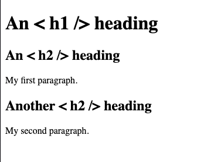
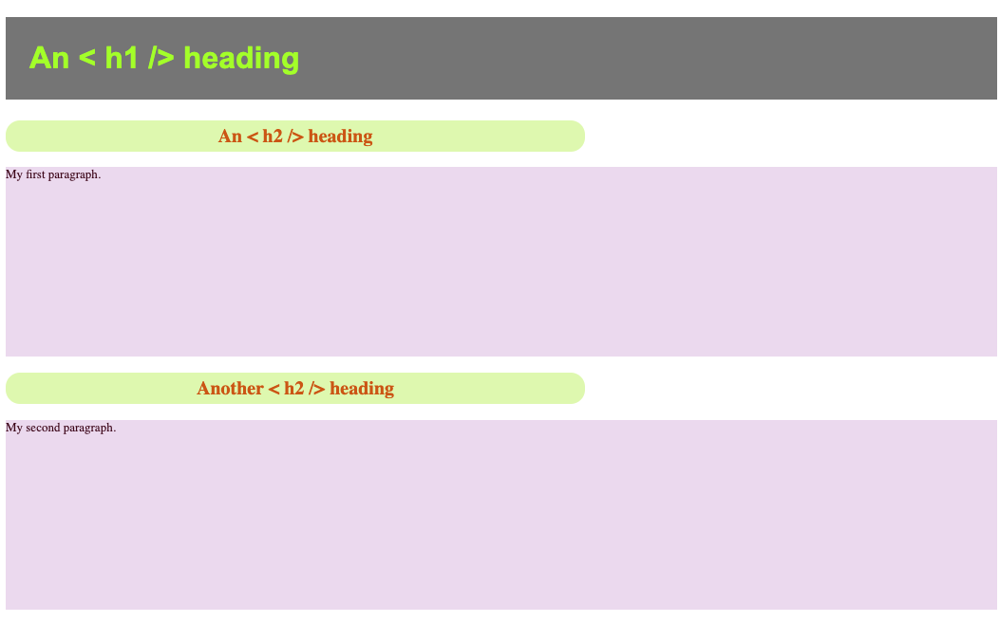
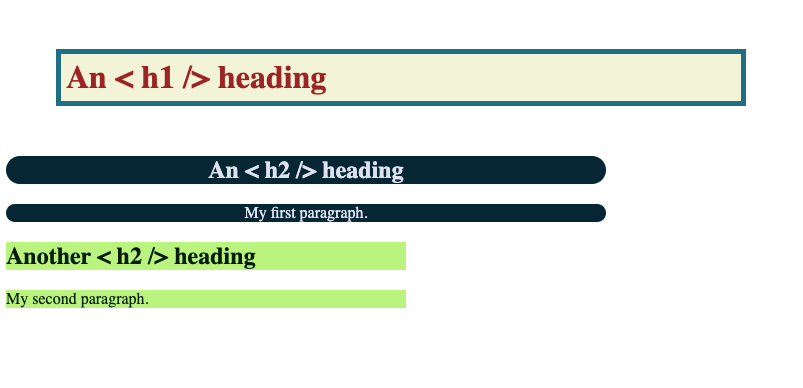

# Step 4: Style the homepage with CSS
CSS stands for Cascading Style Sheets and describes how our HTML elements should be displayed on screen. It can save a lot of work, as we can style the same kind of HTML element with one CSS reference. 

For example, imagine a webpage where we have a header (`<h1 />`), a subheading (`<h2 />`), some text (`<p />`), then another subheading (`<h2 />`) and some more text (`<p />`).</br>
``` HTML
<!DOCTYPE html>
<html>
    <body>
        <h1>An < h1 /> heading</h1>
        <h2>An < h2 /> heading</h2>
        <p>My first paragraph.</p>
        <h2>Another < h2 /> heading</h2>
        <p>My second paragraph.</p>
    </body>
</html>
```
It looks something like this:



## a) Using HTML tags
Instead of individually applying styles to each element one by one, we can style all instances of the type of element (the tag). So all subheadings (`<h2 />`) and text blocks (`<p />`) can have the same style.

### Example using HTML tags
Based on the example above, I've styled each type of element with some basic CSS. Any colors (e.g. `background-color`, `color`) can be styled in a few different ways. Don't forget everything is done in American English.
1. Color name, e.g. `gray` or `greenyellow`.
2. Hex color code, e.g. `#E2F9B8` or `#D16014`.
3. RGB, e.g. `rgb(238, 222, 240)` or `rgb(70, 3, 28)`.

A hex code is a six-digit combination of numbers and letters defined by its mix of red, green and blue (RGB) for a color.</br>
RGB is a model where the red, green and blue primary colors are added together in various ways to reproduce a broad array of colors.

``` css
h1 {
    background-color: gray;  /* uses color name */
    color: greenyellow;
    font-family: Arial, sans-serif; /* tells the browser which font to use */
    padding: 25px; /* tells the browser how much padding to put around the element */
}

h2 {
    background-color: #E2F9B8; /* uses hex code */
    color: #D16014;
    border-radius: 15px; /* tells the browser how rounded you want the element's box to be */
    text-align: center; 
    font-size: 20px; /* uses pixels for the text size */
    max-width: 600px; /* tells the browser this element should only go up to 600px wide - it can go smaller if you decrease your screen size */
    padding: 5px;
}

p {
    background-color: rgb(238, 222, 240); /* uses RGB code */
    color: rgb(70, 3, 28);
    font-size: small; /* you can also use words for text size */
    height: 200px; /* will always display at this height */
}
```
This set of CSS rules will be applied to our headers and paragraphs as so:



Have a look through [the w3schools CSS docs](https://www.w3schools.com/css/css_intro.asp) for some more info and quick practice sessions.

## b) Using classes and ids
As well as using HTML tags to style specific types of element, we can give a name to any set of elements, called a class or an id.</br>
A [class](https://www.w3schools.com/html/html_classes.asp) is normally something you use for multiple elements, whereas an [id](https://www.w3schools.com/html/html_id.asp) is a unique name for one element.

### Example using classes and ids
Going back to our example above, let's say we wanted to separate the first subheader and paragraph from the second, but keep the main header as its own element.</br>
We would add a class to each element that we want to group together to be styled the same and an id to each element that we want to style in a specific way.</br>
You add your class or id as so:
``` HTML
<!DOCTYPE html>
<html>
    <body>
        <h1 id="main-header">An < h1 /> heading</h1>
        <h2 class="first-section">An < h2 /> heading</h2>
        <p class="first-section">My first paragraph.</p>
        <h2 class="second-section">Another < h2 /> heading</h2>
        <p class="second-section">My second paragraph.</p>
    </body>
</html>
```
Now we can style our webpage using those ids and classes, like this:
``` css
#main-header {  /* we use the hash # symbol for ids */
 background-color: beige;
    color: brown;
    border-style: solid;
    border-color: #1F7A8C;
    border-width: 5px;
    padding: 5px;
    margin: 50px;
}

.first-section { /* we use a full stop . for classes */
    background-color: #022B3A;
    color: #E1E5F2;
    border-radius: 15px;
    text-align: center;
    max-width: 600px;5
}

.second-section {
    background-color: rgb(194, 245, 136);
    color: rgb(1, 30, 5);
    width: 400px;
}
```
This set of CSS rules will be applied to our HTML as so:



## c) Your turn!
Using the documentation links and examples provided have a go at styling the homepage.

[coolors.co](https://coolors.co/) is a great resource to help you with colors and themes.

1. Open `src/pages/index.vue`.
2. You'll notice that there are already a couple of classes defined - `home` and `cards-container` in the `<template />` section.
3. There are already some styles defined in the `<style> ... </style>` section for `home`, but `cards-container` needs some rules. Add a few rules here and reload your webpage to see how it looks!
4. Add some more classes or ids to any of the elements in the `<template />` section. 
5. Define the styles using css in the `<style> ... </style>` section.

<hr style="margin-top: 32px">
<div style="display: flex; justify-content: space-between; margin-top: 16px; font-weight: bold; font-size: 16px">
  <span><a href="./step-3.md">← Previous Step</a></span>
  <span><a href="README.md">🏠 Home</a></span>
</div>